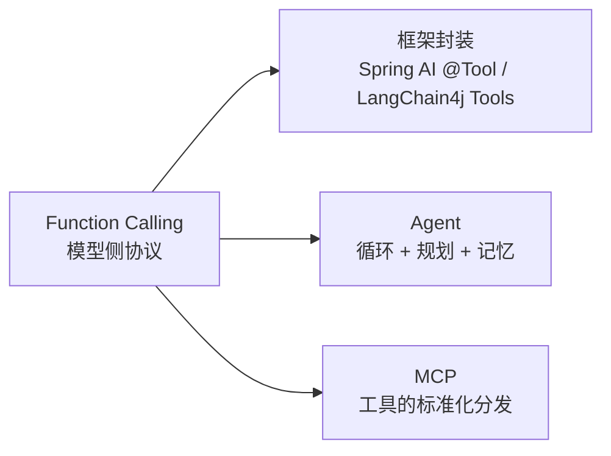

# Function Calling（工具调用）

> 本篇讲协议层原理，不绑定框架。框架封装见 [Spring AI · Tool Calling](../2_frameworks/0_spring_ai) 与 [LangChain4j · Tools](../2_frameworks/1_langchain4j)；工具的标准化分发见 [MCP 协议](../5_advanced/1_mcp)。

## 一、解决什么问题

LLM 本身只会**生成文本**：不知道现在几点、查不了数据库、发不了请求。Function Calling 让模型能以**结构化的方式表达"我想调用什么工具、传什么参数"**，由应用代码真正执行后把结果喂回去——这是 LLM 连接外部世界的基础协议，RAG 检索、Agent、MCP 全部构建在它之上。

**第一关键认知：模型从不执行函数。** 它只输出调用意图（函数名 + JSON 参数），执行永远发生在你的代码里——所以权限控制、参数校验、审计都是应用的责任，而不是模型的。

---

## 二、协议流程


一次完整的工具调用是**两轮请求**（以 OpenAI 兼容格式为例，各家大同小异）：

### 第一轮：带工具定义请求

```json
{
  "model": "gpt-4o",
  "messages": [
    {"role": "user", "content": "北京今天多少度？"}
  ],
  "tools": [{
    "type": "function",
    "function": {
      "name": "get_weather",
      "description": "查询指定城市的当前天气",
      "parameters": {
        "type": "object",
        "properties": {
          "city": {"type": "string", "description": "城市名，如：北京"}
        },
        "required": ["city"]
      }
    }
  }]
}
```

模型判断需要工具时，返回的不是文本而是调用意图：

```json
{
  "choices": [{
    "finish_reason": "tool_calls",
    "message": {
      "role": "assistant",
      "tool_calls": [{
        "id": "call_abc123",
        "type": "function",
        "function": {"name": "get_weather", "arguments": "{\"city\": \"北京\"}"}
      }]
    }
  }]
}
```

### 第二轮：执行后回传结果

应用解析 `arguments`、执行真实函数，把结果以 `role=tool` 消息追加后**再次请求**：

```json
{
  "messages": [
    {"role": "user", "content": "北京今天多少度？"},
    {"role": "assistant", "tool_calls": [ ...原样带上... ]},
    {"role": "tool", "tool_call_id": "call_abc123", "content": "{\"temp\": -2, \"condition\": \"晴\"}"}
  ],
  "tools": [ ...同上... ]
}
```

模型这次返回自然语言：`"北京今天晴，气温零下 2 度。"`（`finish_reason = stop`）

> 注意 `arguments` 是**字符串形式的 JSON**，要二次解析；`tool_call_id` 必须原样对应，多个调用靠它配对。

---

## 三、进阶机制

### 1、并行调用（Parallel Tool Calls）

一次响应里可以返回**多个** `tool_calls`（如"对比北京和上海的天气"→ 两个 `get_weather`）。应用可并发执行，全部结果按各自 `tool_call_id` 回传即可。

### 2、tool_choice：控制是否调用

| 取值 | 行为 | 场景 |
|------|------|------|
| `auto`（默认）| 模型自行判断调不调 | 通用对话 |
| `none` | 禁止调用，只生成文本 | 纯问答阶段 |
| `required` | 必须调用某个工具 | 强制走结构化流程 |
| `{"function": {"name": "x"}}` | 必须调用指定工具 | 意图已确定，只要参数抽取 |

### 3、与 Structured Output 的关系

Function Calling 本质是最早的"结构化输出"手段——早期常定义一个假工具只为拿到 JSON。现在各家提供了专门的 `response_format: json_schema`（约束**最终回答**的格式），两者分工：**要执行动作用 FC，只要格式化数据用 Structured Output**。

### 4、多轮循环：Agent 的雏形

把"第二轮"推广成循环，就是 ReAct 式 Agent 的骨架：

```java
while (true) {
    var resp = llm.chat(messages, tools);
    if (!"tool_calls".equals(resp.finishReason())) {
        return resp.content();                  // 模型认为任务完成
    }
    for (var call : resp.toolCalls()) {
        String result = execute(call);          // 真正干活的地方
        messages.add(toolMessage(call.id(), result));
    }
    // ⚠️ 生产代码必须加最大轮数上限，防止模型循环失控
}
```

Agent 层面的规划与记忆见 [AI Agent](../5_advanced/0_agent)。

---

## 四、工程实践与常见坑

| 坑 | 说明 | 应对 |
|----|------|------|
| **描述写得随意** | `name` / `description` / 参数 description 就是给模型看的 Prompt，质量直接决定命中率和参数准确度 | 像写 API 文档一样写：说清何时该用、参数格式给示例 |
| **参数幻觉** | 模型可能编造不存在的枚举值、错误格式的日期 | `arguments` 解析后**必须校验**，非法时把错误信息作为 tool 结果回传，让模型自己修正重试 |
| **循环失控** | Agent 循环里模型反复调同一工具 | 最大轮数上限 + 重复调用检测 |
| **工具太多** | 数十个工具全塞进 `tools`，命中率下降、token 暴涨 | 按意图分组、动态检索候选工具——这正是 [MCP](../5_advanced/1_mcp) 和 Agent 框架要解决的问题 |
| **副作用无防护** | 模型说删就删 | 写操作工具加确认环节 / 权限白名单；对模型输出保持"不可信输入"的态度 |
| **超时与幂等** | 工具执行慢或失败，重试可能重复执行 | 工具实现按对外接口标准做幂等与超时控制 |

---

## 五、在技术版图中的位置



- **框架**（Spring AI / LangChain4j）：把"定义 JSON Schema、解析 tool_calls、回传结果"封装成注解和回调，开发者只写方法
- **MCP**：解决"工具从哪来"——把工具做成跨应用共享的标准服务端，模型侧仍走 Function Calling
- **Agent**：解决"何时调、按什么顺序调"——在协议之上加规划与循环

---

## 六、相关文档

- [Prompt 工程](./1_prompt)：工具描述本质是 Prompt 的一部分
- [Spring AI](../2_frameworks/0_spring_ai) / [LangChain4j](../2_frameworks/1_langchain4j)：框架层用法
- [AI Agent](../5_advanced/0_agent)：多轮工具循环的完整形态
- [MCP 协议](../5_advanced/1_mcp)：MCP vs Function Calling 的定位差异
