# 高并发总览

> 参考链接：[advanced-java 高并发架构](https://gitee.com/Doocs/advanced-java#%E9%AB%98%E5%B9%B6%E5%8F%91%E6%9E%B6%E6%9E%84)

高并发系统设计的核心目标是：**流量变大时系统依然扛得住** —— 在有限的硬件资源下，支撑尽可能多的并发请求，同时保持合理的响应时间，且流量翻倍时可以通过加机器（而不是重写系统）线性提升容量。

---

## 一、核心要点

高并发系统同时面临两个挑战：**高性能**（单次请求响应快）和**高可用**（整体系统稳定）。高并发模块关注的是二者之上的第三个问题：**规模** —— 请求量从 1k QPS 涨到 10w QPS 时，瓶颈在哪里、如何扩展、如何削峰、如何应对热点。

以下是一个典型的高并发架构，涵盖从接入层到存储层的各个环节：

高并发设计的基本思路可归纳为四句话：

| 思路 | 含义 | 典型手段 |
|------|------|----------|
| **能扩** | 任何一层都能通过加机器提升容量 | 无状态化、负载均衡、分库分表 |
| **少打** | 让请求尽量不落到最慢、最贵的那一层 | 多级缓存、CDN、本地缓存 |
| **慢做** | 非核心、可延迟的工作不在请求链路上同步完成 | MQ 异步、削峰填谷、排队 |
| **分散** | 避免流量集中到单点、单 key、单行 | 热点打散、分桶、请求合并 |

---

## 二、设计维度

| 维度 | 解决的问题 | 核心手段 | 详见 |
|------|------------|----------|------|
| 水平扩展 | 单机容量上限 | 无状态化、服务拆分、负载均衡、自动扩缩容 | [水平扩展与无状态化](/high-con/1_scale_out) |
| 缓存架构 | 读流量压垮数据库 | 浏览器/CDN → Nginx → 本地缓存 → Redis → DB | [缓存架构设计](/high-con/2_cache_architecture) |
| 异步削峰 | 瞬时写流量洪峰 | MQ 解耦、削峰填谷、排队、最终一致 | [异步与削峰](/high-con/3_async_peak_shaving) |
| 数据层扩展 | 单库读写/存储瓶颈 | 读写分离、分库分表、冷热分离、NoSQL/ES | [数据层扩展](/high-con/4_data_scaling) |
| 热点治理 | 流量集中到单 key / 单行 | 热点探测、本地缓存兜底、库存分桶、请求合并 | [热点问题](/high-con/5_hotspot) |
| 参数调优 | 资源配置不匹配流量 | 线程池、Web 容器、连接池、OS 参数 | [并发参数调优](/high-con/6_concurrency_tuning) |
| 容量规划 | 不知道要多少机器 | QPS 估算、压测、冗余系数、大促预案、水位监控 | [容量评估与规划](/high-con/7_capacity_planning) |

---

## 三、与高性能、高可用的关系

"三高"是同一系统的三个观察角度，手段有交叉，但关注点不同：

| 模块 | 核心问题 | 衡量指标 | 典型手段 |
|------|----------|----------|----------|
| [高性能](/high-perf/0_overview) | 单次请求如何更快、更省资源 | RT、P99、CPU/内存占用 | 算法与数据结构、池化、零拷贝、JVM 调优、SQL 优化 |
| **高并发** | 流量大时系统如何扛得住 | 峰值 QPS、并发数、水位 | 水平扩展、缓存、削峰、分片、热点治理 |
| [高可用](/high-avail/0_overview) | 出故障时如何不停服 | 可用性 SLA、MTTR | 冗余、限流、熔断、降级、隔离、故障转移 |

三者的关系：

- **高性能是高并发的基础**：单机 RT 从 100ms 降到 20ms，同样的线程数可承载 5 倍 QPS（Little's Law：`并发数 = QPS × RT`）
- **高可用是高并发的底线**：流量超过容量时，靠限流、降级保住核心链路，而不是整体雪崩
- 同一手段往往兼顾多个目标：缓存既降低 RT（高性能）又分担 DB 流量（高并发），多副本既扩展读能力（高并发）又提供故障转移（高可用）

---

## 四、服务监控

完善的监控体系是高并发系统稳定运行的保障，包括指标采集、链路追踪和告警。没有监控，扩容、调优、容量规划都无从下手。

**监控关键指标**：

| 类别 | 指标 | 关注点 |
|------|------|--------|
| 吞吐 | QPS / TPS | 与容量上限对比，计算水位 |
| 延迟 | P99 / P999 响应时间 | 均值会掩盖长尾，看分位数 |
| 错误 | 5xx / 超时比例 | 突增通常是容量或依赖瓶颈 |
| JVM | GC 频率与停顿、堆使用率 | Full GC 会导致瞬时吞吐下跌 |
| 线程池 | 活跃线程数、队列积压、拒绝次数 | 队列持续积压 = 处理能力不足 |
| 依赖 | 连接池活跃数/等待数、Redis/DB RT | 瓶颈常在下游而不是本服务 |

容量水位与告警阈值的设置见 [容量评估与规划 - 容量水位与告警](/high-con/7_capacity_planning)，完整可观测性方案见 [可观测性](/observability/0_overview)。

---

## 五、模块导航

| 文档 | 内容 |
|------|------|
| [水平扩展与无状态化](/high-con/1_scale_out) | 垂直 vs 水平扩展、Session 外置、服务拆分、负载均衡入口、HPA、有状态服务分片 |
| [缓存架构设计](/high-con/2_cache_architecture) | 多级缓存分层、命中率与一致性取舍、缓存预热、热点 key 探测、缓存三大问题 |
| [异步与削峰](/high-con/3_async_peak_shaving) | 同步转异步、削峰填谷、排队与令牌、流量整形 vs 限流、最终一致性与补偿 |
| [数据层扩展](/high-con/4_data_scaling) | 读写分离与主从延迟、分库分表、分片键、跨分片查询、扩容迁移、冷热分离、NoSQL/ES |
| [热点问题](/high-con/5_hotspot) | 热点 key、热点行更新（库存扣减）、分桶库存、合并更新、请求合并、热点隔离 |
| [并发参数调优](/high-con/6_concurrency_tuning) | 线程池、Tomcat/Undertow、数据库/Redis 连接池、OS 参数、调优流程 |
| [容量评估与规划](/high-con/7_capacity_planning) | QPS 估算、单机压测、机器数计算、存储估算、大促预案、容量水位 |
| [面试高频题](/high-con/99_interview) | 高并发方向高频问题汇总 |
