# 高并发系统设计

> 参考链接：[advanced-java 高并发架构](https://gitee.com/Doocs/advanced-java#%E9%AB%98%E5%B9%B6%E5%8F%91%E6%9E%B6%E6%9E%84)

高并发系统设计的核心目标是：在有限的硬件资源下，支撑尽可能多的并发用户请求，同时保持合理的响应时间和系统稳定性。

---

## 一、核心要点

高并发系统同时面临两个挑战：**高性能**（单次请求响应快）和**高可用**（整体系统稳定）。

---

## 二、设计方案全景

以下是一个典型的高并发架构设计图，涵盖从接入层到存储层的各个环节：

高并发系统的设计通常从以下几个维度入手：系统拆分、缓存加速、异步削峰、数据分离、读写分离和服务监控。

---

### 1、系统拆分

将单体服务拆分为多个微服务，每个服务独立部署、独立扩容，避免单点瓶颈。

**拆分原则**：
- 按业务域拆分（用户、订单、库存、支付各自独立）
- 高频写服务与高频读服务分离
- 无状态服务水平扩展，有状态服务垂直扩展或分片

---

### 2、缓存加速

引入多级缓存，减少数据库压力，提升读取速度。

**典型缓存体系**：
- **本地缓存（Caffeine）**：极低延迟（微秒级），适合热点数据，容量受限
- **分布式缓存（Redis）**：低延迟（毫秒级），集群共享，容量大
- **CDN**：静态资源就近分发，减少回源

---

### 3、MQ 异步削峰

通过消息队列将同步调用解耦为异步处理，平滑流量洪峰。

**典型场景**：
- 秒杀下单：接受请求后立即返回"处理中"，MQ 异步扣库存
- 日志审计：业务操作同步写 DB，日志记录异步写 Kafka
- 邮件/短信通知：主流程完成后异步推送通知

---

### 4、数据分离（分库分表）

当单库写入压力过大时，通过分库分表将数据水平拆分。

**分库**（垂直分库）：按业务域拆分，用户库、订单库、商品库各自独立。

**分表**（水平分表）：同一业务的大表按规则（如 userId % 16）拆成多张表。

---

### 5、读写分离

主库负责写入，从库负责查询，利用主从复制将读压力分散到多个从节点。

**注意事项**：
- 主从复制存在延迟（通常毫秒级），写后立即读可能读到旧数据
- 对一致性要求高的场景（如支付后查余额），应强制走主库读

---

### 6、服务监控

完善的监控体系是高并发系统稳定运行的保障，包括指标采集、链路追踪和告警。

**监控关键指标**：
- **QPS / TPS**：系统吞吐量
- **P99 响应时间**：99 分位延迟
- **错误率**：5xx / 超时比例
- **JVM 指标**：GC 频率、堆内存使用率
- **线程池状态**：活跃线程数、队列积压

详细可观测性方案见 [observability/](../observability/0_observability)。
