# 异步与削峰

> **本篇目标**：把可延迟的工作移出请求链路，把瞬时写洪峰摊平到下游能承受的速率，并保证异步之后数据最终一致。
>
> **前置阅读**：[缓存架构设计](./3_cache_architecture)

> 参考链接：[RocketMQ 事务消息](https://rocketmq.apache.org/zh/docs/featureBehavior/04transactionmessage) · [Kafka 官方文档](https://kafka.apache.org/documentation/)

缓存解决"读"的扩展，异步解决"写"和"重"的扩展：**主链路只做必须同步完成的步骤，其余工作交给队列按下游能力匀速处理。**

---

## 一、同步转异步

**先把请求链路上的步骤分成"必须同步"和"可以延后"，再为可延后的部分选择异步模式。** 本篇讲跨服务、面向流量的异步；进程内的并行调用（`CompletableFuture` 聚合）、批量化与请求合并属于单请求性能优化，见 [异步与批量](/high-perf/8_async_batch)。

### 1、常见模式

| 模式 | 做法 | 适用场景 |
|------|------|----------|
| **事件通知** | 主流程完成后发 MQ 事件，下游各自订阅 | 下单后发短信、加积分、更新搜索索引 |
| **受理 + 异步回执** | 立即返回受理号，客户端通过轮询 / 回调 / WebSocket 获取结果 | 秒杀下单、报表导出、批量导入 |
| **写缓冲（Write-Behind）** | 先写 Redis 或内存队列，后台批量落库 | 点赞数、浏览量、埋点 |



### 2、收益与代价

| 收益 | 说明 |
|------|------|
| 降低 RT | 主链路只做核心步骤，接口响应可从数百毫秒降到几十毫秒 |
| 提升吞吐 | Web 线程快速释放，同样线程数承载更多请求 |
| 削峰填谷 | 洪峰先堆积在 MQ，消费端按自身能力匀速处理 |
| 故障隔离 | 下游（短信、积分）故障不影响主流程，恢复后继续消费 |

**代价**：结果不再实时可见；要处理消息丢失、重复、乱序；链路排查更复杂。Write-Behind 在缓冲未落库时宕机会丢数据，只适合允许少量误差的计数类数据。

---

## 二、削峰填谷

**MQ 的写入能力远高于数据库，洪峰先落进队列，消费端再按下游容量匀速处理**——用延迟换稳定。

### 1、原理

瞬时流量 10w QPS 持续 10 秒，下游数据库只能承受 5000 TPS：

| 阶段 | 同步处理 | 引入 MQ 后 |
|------|----------|------------|
| 生产端 | 10w QPS 直接打到 DB | 10 秒内写入 100w 条消息（MQ 顺序写磁盘） |
| 消费端 | — | 以 5000 TPS 匀速消费，约 200 秒处理完 |
| 结果 | DB 被打垮 | DB 始终在安全水位，最后一条消息延迟约 200 秒 |

削峰的前提是**业务能接受这个延迟**；200 秒的延迟对下单通知可以接受，对支付结果就需要配合用户侧排队和结果查询。

### 2、控制消费速率

**消费端速率要可控且与下游容量匹配，而不是越快越好。**

| MQ | 控制手段 |
|----|----------|
| Kafka | `max.poll.records` 控制单批拉取数；消费者实例数 ≤ 分区数；必要时 `pause()` / `resume()` 暂停拉取 |
| RocketMQ | 消费线程数、`pullBatchSize`、`consumeMessageBatchMaxSize`；原生客户端的线程池使用无界队列，实际并发由 `consumeThreadMin` 决定 |
| RabbitMQ | `prefetch`（basic.qos）限制未确认消息数；消费者数 |

在消费逻辑内再加一层限速，可以精确控制落库速率：

```java
@Slf4j
@Component
@RequiredArgsConstructor
@RocketMQMessageListener(topic = "order-create", consumerGroup = "order-create-cg",
        consumeThreadNumber = 20)        // 并发消费线程数（旧版本 rocketmq-spring 为 consumeThreadMax）
public class OrderCreateConsumer implements RocketMQListener<OrderMsg> {

    private final OrderService orderService;

    // Guava RateLimiter：单实例每秒最多处理 500 条，N 个实例的总速率 = 500 × N
    private final RateLimiter limiter = RateLimiter.create(500);

    @Override
    public void onMessage(OrderMsg msg) {
        limiter.acquire();
        // MQ 至少一次投递，处理必须幂等（按订单号去重）
        orderService.createIfAbsent(msg);
        log.debug("订单创建完成, orderNo={}", msg.getOrderNo());
    }
}
```

::: tip 总速率随实例数变化
单实例限速时，消费者扩容会同步放大总速率。如果下游容量是硬上限，应按 `下游容量 / 实例数` 设置单实例速率，或改用分布式限流。
:::

### 3、积压的监控与处理

- 监控**消费延迟（Lag）**：Kafka 看 consumer lag，RocketMQ 看消费组的堆积量（`diffTotal`）
- 积压时先判断是"消费变慢"（下游故障）还是"生产突增"（正常洪峰），前者先修下游，盲目扩容只会加重下游压力
- 临时扩容：增加消费者实例（Kafka 受分区数上限约束），或把消息转存到分区更多的临时 Topic 再并行消费
- 对时效敏感的消息设置过期丢弃，避免处理已无意义的旧请求

MQ 本身的消费模型与堆积处理见 [消息队列](/messaging/0_overview)。

---

## 三、用户侧排队

**MQ 是系统内部排队；秒杀、抢票、挂号等场景还要在用户侧排队**，从入口就把请求量压到与库存相当的量级。

| 方案 | 做法 | 效果 |
|------|------|------|
| **令牌发放** | 活动开始前按库存量发放有限令牌（如库存 × 1.5），无令牌请求直接返回"已抢完" | 把 100w 请求过滤到 1.5w 量级 |
| **排队队列** | 请求写入 Redis List / ZSet，返回排队序号，前端轮询 | 用户体验可控，后端匀速处理 |
| **异步下单** | 请求通过校验后发 MQ，前端轮询下单结果 | 最终写 DB 的只有真实成交量 |

秒杀的完整链路（前端静态化、网关限流、Redis 预扣、MQ 异步下单）见 [秒杀](/scenario/4_seckill)。

---

## 四、流量整形 vs 限流

**两者都控制流量速率：整形让超出部分排队等待，限流让超出部分直接失败。**

| 对比项 | 流量整形（Traffic Shaping） | 限流（Rate Limiting） |
|--------|-----------------------------|------------------------|
| 目标 | 把不均匀的流量变平滑 | 保护系统不被超出容量的流量压垮 |
| 超出部分 | **缓冲、排队、延后处理** | **直接拒绝**（快速失败） |
| 典型手段 | 漏桶、MQ 缓冲、排队 | 令牌桶、滑动窗口、计数器 |
| 请求结果 | 最终都会被处理（延迟增加） | 被拒请求需客户端重试或放弃 |
| 归属 | 高并发（扛住流量） | 高可用（保护系统） |
| 场景 | 下单、支付回调、数据同步 | 接口防刷、网关总量保护 |

**组合使用**：网关先限流挡住超出总容量的请求，放行的请求进入 MQ 整形，消费端匀速落库。限流算法与过载保护见 [限流与过载保护](/high-avail/7_rate_limiting)。

---

## 五、最终一致性与补偿

**异步之后多个步骤不再处于同一个本地事务中，需要用"可靠投递 + 幂等消费 + 补偿对账"保证最终一致。**

| 问题 | 方案 |
|------|------|
| 本地事务成功但消息没发出去 | **本地消息表（Outbox）**：业务数据与消息记录同一事务写入，再由中继任务投递；或 RocketMQ **事务消息** |
| 消息重复投递 | 消费端**幂等**：唯一键约束、状态机、去重表，见 [幂等设计](/architecture/5_idempotence) |
| 消费失败 | 有限次重试 + 死信队列 + 人工 / 定时补偿 |
| 异步步骤失败需回滚 | Saga：每个步骤定义补偿操作（如取消订单 → 回补库存） |
| 状态长时间不一致 | 对账任务：定时比对上下游数据，发现差异自动修复或告警 |

### 1、写入消息表

```java
@Transactional(rollbackFor = Exception.class)
public void createOrder(OrderCmd cmd) {
    orderMapper.insert(Order.from(cmd));
    // 同一事务写入消息表，保证"订单存在 ⇔ 消息存在"
    outboxMapper.insert(new OutboxMsg("order-created", cmd.getOrderNo(), JSON.toJSONString(cmd)));
}
```

### 2、中继投递：防止多实例重复投递

**应用多实例部署时，每个实例的定时任务都会扫到同一批待发送消息**，必须保证同一条消息同一时刻只被一个实例处理。常用两种做法：

| 做法 | 原理 | 特点 |
|------|------|------|
| `SELECT … FOR UPDATE SKIP LOCKED` | 各实例锁定不同的行，已被锁的行直接跳过 | 多实例并行投递，吞吐随实例数提升；需 MySQL 8.0+ / PostgreSQL 9.5+ |
| 分布式锁 / 单实例调度 | 同一时刻只有一个实例执行中继任务（Redisson、ShedLock、XXL-JOB 单机路由） | 实现简单，但投递吞吐受单实例限制 |

以 `SKIP LOCKED` 为例，锁定与标记在同一事务内完成：

```java
public interface OutboxMapper {
    // 需要 (status, id) 索引，否则会锁住大量扫描到的行
    @Select("SELECT * FROM outbox WHERE status = 0 ORDER BY id LIMIT #{limit} FOR UPDATE SKIP LOCKED")
    List<OutboxMsg> lockPending(@Param("limit") int limit);

    @Update("UPDATE outbox SET status = 1, sent_at = NOW() WHERE id = #{id}")
    int markSent(@Param("id") long id);
}

@Slf4j
@Service
@RequiredArgsConstructor
public class OutboxRelayService {

    private final OutboxMapper outboxMapper;
    private final MqProducer mqProducer;

    /** 单批投递：事务提交前行锁一直持有，其他实例会跳过这些行 */
    @Transactional(rollbackFor = Exception.class)
    public int relayBatch(int limit) {
        List<OutboxMsg> batch = outboxMapper.lockPending(limit);
        for (OutboxMsg msg : batch) {
            mqProducer.syncSend(msg.getTopic(), msg.getKey(), msg.getPayload()); // 同步发送，失败抛异常回滚本批
            outboxMapper.markSent(msg.getId());
        }
        return batch.size();
    }
}

@Slf4j
@Component
@RequiredArgsConstructor
public class OutboxRelayJob {

    private final OutboxRelayService relayService;

    // 调度方法与事务方法分属两个 Bean，确保 @Transactional 经过代理生效
    @Scheduled(fixedDelay = 1000)
    public void relay() {
        try {
            int sent = relayService.relayBatch(100);
            if (sent > 0) {
                log.debug("outbox 投递 {} 条", sent);
            }
        } catch (Exception e) {
            log.error("outbox 投递失败，下个周期重试", e);
        }
    }
}
```

::: warning 仍然是"至少一次"
消息发送成功但事务回滚（如后一条发送失败、`markSent` 失败）时，下个周期会再发一次，所以**消费端必须幂等**。批量不宜过大：事务内持有行锁并等待 MQ 响应，批越大锁持有越久。对投递延迟要求更高时，可改用 CDC（如 Debezium 监听 outbox 表的 Binlog）替代轮询。
:::

分布式事务的完整方案（2PC、TCC、Saga、事务消息）见 [分布式事务](/distributed/4_transaction)；消息不丢失、不重复、顺序性等可靠性保障见 [消息队列](/messaging/0_overview)。

---

## 六、设计清单

- [ ] 区分核心步骤与可异步步骤，主链路只保留必须同步完成的部分
- [ ] 异步接口有明确的结果查询方式（轮询 / 回调 / 推送）
- [ ] 消费端速率可控，且与下游容量匹配
- [ ] 消费逻辑幂等
- [ ] 有消息发送可靠性保障（本地消息表 / 事务消息），中继任务在多实例下不重复投递
- [ ] 有重试上限、死信队列与补偿 / 对账机制
- [ ] 监控消费延迟与积压，设置告警阈值

---

## 小结

- 同步转异步的三种模式：事件通知、受理 + 异步回执、Write-Behind；进程内并行聚合属于高性能范畴
- 削峰填谷用延迟换稳定，关键是消费速率可控，并监控积压
- 秒杀类场景在用户侧用令牌和排队先把请求量压下来
- 整形让超出部分排队，限流让超出部分失败，两者组合使用
- 异步之后靠本地消息表 / 事务消息 + 幂等消费 + 对账保证最终一致，中继任务要防多实例重复投递

> 下一篇：[数据层扩展](./5_data_scaling) —— 削峰之后落到存储的流量，如何靠读写分离与分库分表承接。
