# JWT 令牌机制

> 参考资料：
> * JWT RFC 7519：[https://datatracker.ietf.org/doc/html/rfc7519](https://datatracker.ietf.org/doc/html/rfc7519)
> * jwt.io（在线解码工具）：[https://jwt.io/](https://jwt.io/)

> JWT 在 OAuth2 / OIDC 中的使用场景见 → [OAuth2](/security/2_oauth2) / [OIDC](/security/3_oidc)
>
> Spring Security 中 JWT 集成实践见 → [Spring Security](/spring/9_spring_security)

---

## 一、是什么

**JWT（JSON Web Token）**：一种紧凑、自包含的令牌格式标准，用于在各方之间安全传递信息。

**自包含** 是 JWT 最大的特点 —— 令牌本身携带了用户信息，服务端**无需查库**即可验证，天然适合无状态分布式系统。

> JWT 不是认证协议，只是一种**令牌格式**，可用于 OAuth2、OIDC、普通 API 认证等任何需要传递声明的场景。

---

## 二、结构



JWT 由三部分组成，用 `.` 分隔：

```
xxxxx.yyyyy.zzzzz
  │      │      │
Header  Payload  Signature
```

### Header（头部）

```json
{
  "alg": "HS256",   // 签名算法
  "typ": "JWT"
}
```

### Payload（载荷）

```json
{
  "sub": "user-001",          // Subject：用户唯一标识
  "iss": "my-auth-server",    // Issuer：签发方
  "aud": "my-api",            // Audience：受众
  "iat": 1715000000,          // Issued At：签发时间（Unix 时间戳）
  "exp": 1715003600,          // Expiration：过期时间
  "roles": ["admin", "user"], // 自定义声明
  "username": "zhangsan"
}
```

> ⚠️ Payload 只是 Base64 编码，**不加密**，不要放密码、手机号等敏感信息。

### Signature（签名）

```
HMACSHA256(
  base64UrlEncode(header) + "." + base64UrlEncode(payload),
  secret
)
```

签名用于验证令牌未被篡改，服务端持有密钥（对称）或公钥（非对称）即可校验。

---

## 三、签名算法

| 算法 | 类型 | 说明 |
|------|------|------|
| **HS256** | 对称（HMAC） | 同一个 secret 签名和验证，简单但密钥需保密共享 |
| **RS256** | 非对称（RSA） | 私钥签名，公钥验证，适合多服务验证场景 |
| **ES256** | 非对称（ECDSA） | 比 RS256 密钥更短，性能更好，推荐新项目使用 |

**选型建议：**
- 单体或内部服务：HS256 够用
- 多服务 / 微服务 / 需要对外公开验证：RS256 / ES256（公钥可公开，私钥只在认证服务）

---

## 四、失效与刷新策略

JWT 无状态的代价是**难以主动吊销**，常见应对方案：

| 策略 | 做法 | 代价 |
|------|------|------|
| **短有效期** | access_token 设 15 分钟～1 小时 | 用户需频繁刷新 |
| **Refresh Token** | 用长效 refresh_token 换新 access_token | 需存储 refresh_token |
| **黑名单** | 吊销时将 jti（JWT ID）存入 Redis 黑名单 | 引入存储依赖，损失部分无状态性 |
| **版本号** | 用户改密码时递增版本号，JWT 携带版本号，服务端比对 | 需查库，但只存一个字段 |

---

## 五、在 Spring Boot 中使用

```java
// 依赖：io.jsonwebtoken:jjwt-api / jjwt-impl / jjwt-jackson

// 生成 Token
public String generateToken(String userId, List<String> roles) {
    return Jwts.builder()
        .subject(userId)
        .claim("roles", roles)
        .issuedAt(new Date())
        .expiration(new Date(System.currentTimeMillis() + 3600_000)) // 1小时
        .signWith(getSecretKey())
        .compact();
}

// 解析 Token
public Claims parseToken(String token) {
    return Jwts.parser()
        .verifyWith(getSecretKey())
        .build()
        .parseSignedClaims(token)
        .getPayload();
}

// 自定义过滤器：从请求头提取 JWT 写入 SecurityContext
@Component
public class JwtAuthFilter extends OncePerRequestFilter {
    @Override
    protected void doFilterInternal(HttpServletRequest req,
                                    HttpServletResponse res,
                                    FilterChain chain) throws ... {
        String token = req.getHeader("Authorization");
        if (token != null && token.startsWith("Bearer ")) {
            Claims claims = parseToken(token.substring(7));
            // 写入 SecurityContextHolder...
        }
        chain.doFilter(req, res);
    }
}
```

---

## 六、常见安全问题

| 问题 | 说明 | 防护 |
|------|------|------|
| **alg=none 攻击** | 攻击者修改 header 的 alg 为 none 绕过签名验证 | 服务端强制指定算法，拒绝 alg=none |
| **弱密钥** | HS256 使用短密钥被暴力破解 | 密钥长度 ≥ 256 bit，使用随机生成的强密钥 |
| **Payload 存敏感信息** | Payload 只是 Base64，任何人可解码 | 不存密码、手机号，只存 userId / roles |
| **Token 不过期** | 长期有效的 Token 泄露影响大 | 合理设置 exp，结合 refresh_token 机制 |
| **XSS 导致 Token 泄露** | Token 存 localStorage，被 XSS 脚本读取 | 存 httpOnly Cookie，或做 XSS 防护 |

## 七、密钥轮换与吊销

### 7.1 RS256 / ES256 密钥轮换

非对称签名适合微服务场景：认证服务持有私钥并签发 Token，业务服务只持有公钥并验证 Token。

推荐做法：

- JWT Header 中必须带 `kid`，用于标识签名密钥版本。
- 认证服务维护多组密钥：`current` 用于签发，`previous` 用于验证尚未过期的旧 Token。
- 轮换时先发布新公钥，再切换签发私钥，最后等待旧 Token 自然过期后下线旧公钥。
- 私钥只保存在认证服务或 KMS / Vault 中，不进入 Git、镜像、日志和前端包。
- 业务服务缓存 JWKS 时要设置合理 TTL，并支持主动刷新，避免密钥切换后大面积验证失败。

### 7.2 JWT 黑名单

JWT 天然是无状态的，签发后在 `exp` 到期前通常都可用。以下场景需要服务端吊销能力：

- 用户主动退出登录。
- 密码修改、MFA 重置、账号禁用。
- Token 泄露或设备丢失。
- 权限发生高风险变更。

常见实现：

```java
// Redis key: jwt:blacklist:{jti}
// TTL = token.exp - now，避免黑名单无限增长
redisTemplate.opsForValue().set(
    "jwt:blacklist:" + jti,
    "revoked",
    Duration.between(Instant.now(), tokenExpiresAt)
);
```

验证流程：

1. 校验签名、`exp`、`iss`、`aud`。
2. 读取 `jti`，检查是否在 Redis 黑名单中。
3. 对关键接口可额外校验用户状态、密码版本号或权限版本号。

### 7.3 多服务公钥分发

多服务环境中不要手工复制公钥文件，推荐提供 JWKS 端点：

```text
GET /.well-known/jwks.json
```

业务服务通过 `kid` 选择对应公钥验证签名。公钥分发要注意：

- JWKS 端点必须走 HTTPS。
- 返回当前公钥和仍在有效期内的旧公钥。
- 公钥缓存 TTL 不宜过长，通常按 Token 有效期和轮换频率折中。
- 验证端必须固定允许的 `alg`，不能完全信任 JWT Header 中的算法字段。
