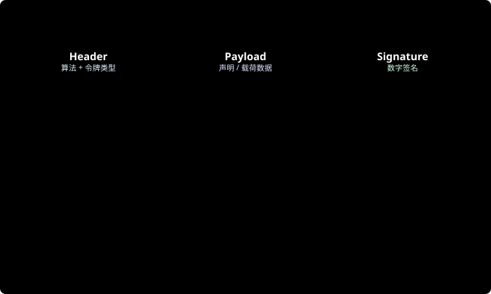

# JWT 令牌机制

> 前置阅读：[HTTP](/protocols/2_http)、[分布式会话](/distributed/5_session)

JWT 是一种令牌格式而非认证协议，可承载访问令牌、ID Token 或会话凭证。本篇讲结构与算法、校验、双 Token 与吊销、密钥轮换与存储，基线为 Spring Security 7.0。

---

## 一、JWT 是什么

JWT 定义于 RFC 7519。本篇是站内 JWT 的主文档，代码基线为 Spring Boot 4 / Spring Security 7，签发示例直接使用内置的 Nimbus JOSE + JWT 库。

最常见的 JWT 是一个**紧凑序列化的 JWS**（JSON Web Signature，RFC 7515）：声明以 JSON 表示，经过签名保证不被篡改，但内容**不加密**。需要保密时用 JWE（RFC 7516）或干脆不用 JWT。

JWT 的核心特点是**自包含**：资源服务拿到令牌后只需验签和检查声明，不用回查数据库或会话存储，适合多服务、多实例的无状态部署。代价也来自这一点：令牌一旦签发，在 `exp` 之前天然有效，吊销需要额外设计（见第七节）。

| 对比项 | JWT（自包含） | 不透明令牌（opaque） |
|--------|---------------|----------------------|
| 令牌内容 | 声明 + 签名，任何人可解码查看 | 随机字符串，无含义 |
| 校验方式 | 本地验签 | 查存储或调用内省端点（RFC 7662） |
| 吊销 | 难，需要黑名单或版本号 | 删掉记录即可 |
| 适合 | 访问令牌、跨服务传递身份 | Refresh Token、需要即时吊销的场景 |

---

## 二、结构



JWT 由 `Header.Payload.Signature` 三段组成，每段都是 Base64URL 编码，用 `.` 连接。

**Header** 说明签名算法、密钥标识和令牌类型：

```json
{
  "alg": "ES256",
  "kid": "2026-10-key-b",
  "typ": "at+jwt"
}
```

**Payload** 存放声明（claims）。下面是一个符合 RFC 9068 的访问令牌：

```json
{
  "iss": "https://auth.example.com",
  "sub": "10086",
  "aud": "https://api.example.com",
  "client_id": "web-bff",
  "scope": "order:read order:write",
  "iat": 1791590400,
  "exp": 1791591300,
  "jti": "5f0c9a3e-7d1b-4a52-9a1e-2f6c0e8b4d11"
}
```

| 声明 | 含义 | 校验要点 |
|------|------|----------|
| `iss` | 签发方 | 必须与配置的签发方完全一致 |
| `sub` | 主体，通常是用户 ID | 用不可变 ID，不用用户名或手机号 |
| `aud` | 受众，令牌给谁用 | 必须包含本服务的标识，防止 A 服务的令牌拿去调 B 服务 |
| `exp` / `nbf` / `iat` | 过期、生效、签发时间（Unix 秒） | 允许少量时钟偏差，Spring Security 默认 60 秒 |
| `jti` | 令牌唯一 ID | 吊销黑名单的键 |
| `client_id` / `scope` | 申请令牌的客户端与授权范围（RFC 9068） | 按接口要求检查 scope |

**Signature** 对前两段签名，签名输入是 `BASE64URL(Header) + "." + BASE64URL(Payload)`，再用 Header 中 `alg` 指定的算法和密钥计算。HS256 即 `HMAC-SHA256(签名输入, secret)`；RS256 / ES256 用私钥签名、公钥验证。

::: warning Payload 不是加密
Base64URL 只是编码，任何拿到令牌的人都能解出 Payload。不要放密码、手机号、身份证号等敏感数据，也不要放会频繁变化的大段权限列表（令牌会被每个请求携带）。
:::

---

## 三、签名算法

| 算法 | 类型 | 密钥 / 签名长度 | 特点 |
|------|------|-----------------|------|
| HS256 | 对称（HMAC-SHA256） | 密钥 ≥ 256 位 / 32 字节 | 最快；签发方和验证方共享同一个 secret，谁能验签谁就能伪造 |
| RS256 | 非对称（RSA PKCS#1 v1.5） | 2048 位以上 / 256 字节 | 生态支持最广；验签很快，签名较慢，令牌偏长 |
| PS256 | 非对称（RSA-PSS） | 同 RS256 | 比 PKCS#1 v1.5 更稳健的 RSA 填充，部分 IdP 支持 |
| ES256 | 非对称（ECDSA P-256） | 256 位 / 64 字节 | 密钥和签名短，签名快；验签通常比 RSA 慢；签名依赖高质量随机数 |
| Ed25519 | 非对称（EdDSA） | 256 位 / 64 字节 | 签名和验签都快，签名确定性（不依赖随机数）；生态支持仍在补齐 |

关于 Ed25519：早期 JOSE 用多态标识 `EdDSA`，曲线由密钥决定；RFC 9864（2025 年 10 月）引入完全确定的算法名 `Ed25519` / `Ed448`，并把 `EdDSA` 标为废弃。Spring Security 的 `SignatureAlgorithm` 枚举目前只有 RS / PS / ES 三个系列，用 Ed25519 需要直接配置 Nimbus 的 `JWSKeySelector`，接入前确认签发方、网关与所有资源服务都支持。

**选型建议**：

- **多服务、对接 IdP、需要对外验签**：用 ES256 或 RS256。私钥只在签发方，其他服务通过 JWKS 拿公钥。
- **单体应用自签自验**：HS256 可以接受，但 secret 要用安全随机数生成、至少 32 字节，并放在密钥管理服务里。只要有第二个服务需要验签，就换成非对称算法。
- 新系统优先 ES256；需要兼容老客户端或硬件（HSM / KMS 对 RSA 支持更普遍）时用 RS256。

---

## 四、alg=none 与算法混淆攻击

JWT 的 Header 由客户端提交，攻击者可以随意修改。如果验证代码**按 Header 里的 `alg` 决定怎么验签**，就会出现两类经典漏洞（RFC 8725 §2.1）：

| 攻击 | 做法 | 后果 |
|------|------|------|
| alg=none | 把 `alg` 改成 `none`，删掉签名段 | 库若接受不签名的令牌，任意伪造身份 |
| 算法混淆（RS256 → HS256） | 把 `alg` 改成 `HS256`，用**公开的 RSA 公钥**当 HMAC secret 计算签名 | 库若用"当前配置的密钥 + Header 中的算法"验签，HMAC 校验通过，伪造成功 |
| 伪造密钥来源 | 在 Header 中放 `jku` / `x5u` / `jwk`，指向攻击者自己的公钥 | 库若信任这些头去拉公钥，攻击者自签自验 |
| `kid` 注入 | 在 `kid` 中放路径穿越或 SQL 片段 | 服务端用 `kid` 拼文件路径或 SQL 时被利用 |

防护原则只有一条：**验签方式由服务端决定，不由令牌决定**。

- 为每把密钥绑定唯一算法，维护允许的算法白名单，`none` 永远不在白名单里。
- 公钥只从预先配置的可信 JWKS 地址获取，忽略令牌里的 `jku` / `x5u` / `jwk`。
- `kid` 只用于在已加载的密钥集合中查找，不参与拼接路径、SQL 或 URL。

Spring Security 的 `NimbusJwtDecoder` 默认只接受 RS256，需要其他算法时必须显式声明；它基于 Nimbus 的 `JWSVerificationKeySelector`，按"算法白名单 + JWKS 中的 kid"选密钥，不会被上面的手法绕过。真正的风险来自手写的解析代码，这也是不建议自己写 JWT 过滤器的原因。

---

## 五、校验清单与 Spring Security 实现

OAuth2 的授权流程见 [OAuth2](./2_oauth2)，Spring Security 过滤器链与 `JwtEncoder` 签发的写法见 [Spring Security](/spring/9_security)。

### 1、RFC 8725 校验清单

资源服务收到令牌后，按下面的顺序校验，任一项失败返回 401（错误码 `invalid_token`）：

| 序号 | 检查 | 说明 |
|------|------|------|
| 1 | `alg` 在白名单内 | 白名单写在配置里，与密钥绑定 |
| 2 | 按 `kid` 从可信 JWKS 选公钥验签 | 不信任 `jku` / `x5u` / `jwk` 头 |
| 3 | `typ` 显式类型 | 访问令牌用 `at+jwt`（RFC 9068），防止 ID Token 或其他用途的 JWT 被当作访问令牌 |
| 4 | `iss` 完全匹配 | 多签发方时每个签发方使用各自的密钥 |
| 5 | `aud` 包含本服务 | 防止令牌在服务之间被挪用 |
| 6 | `exp` / `nbf` | 时钟偏差只放宽几十秒 |
| 7 | 业务声明 | `scope`、`client_id`、租户等 |
| 8 | 吊销状态 | `jti` 黑名单、令牌版本号，见第七节 |

RFC 8725 还要求：不同用途的 JWT（访问令牌、ID Token、邮件验证链接等）要能互相区分，最好使用不同的密钥或不同的 `typ` / `aud`，避免"一种令牌被拿去冒充另一种"。IETF 正在修订 RFC 8725（draft-ietf-oauth-rfc8725bis，截至 2026 年 10 月仍是草案），补充了近年发现的攻击，落地时以正式 RFC 为准。

### 2、只用配置：对接授权服务器

依赖 `spring-boot-starter-security-oauth2-resource-server`（Boot 4 的新名字，旧名 `spring-boot-starter-oauth2-resource-server` 已废弃）。对接 Keycloak、Spring Authorization Server 等签发方时，大多数检查只需配置：

```yaml
spring:
  security:
    oauth2:
      resourceserver:
        jwt:
          issuer-uri: https://auth.example.com     # 自动发现 JWKS 并校验 iss
          audiences: https://api.example.com       # 校验 aud
          jws-algorithms: ES256                    # 算法白名单，默认只有 RS256
```

```java
@Configuration
@EnableWebSecurity
public class ApiSecurityConfig {

    @Bean
    SecurityFilterChain apiChain(HttpSecurity http) throws Exception {
        http
            .securityMatcher("/api/**")
            .authorizeHttpRequests(auth -> auth
                .requestMatchers(HttpMethod.GET, "/api/public/**").permitAll()
                .requestMatchers("/api/orders/**").hasAuthority("SCOPE_order:read")
                .anyRequest().authenticated())
            .sessionManagement(session -> session.sessionCreationPolicy(SessionCreationPolicy.STATELESS))
            // 只接受 Authorization 头的 API 可以关闭 CSRF；用 Cookie 传凭证的接口不能关，见第九节
            .csrf(csrf -> csrf.disable())
            .oauth2ResourceServer(oauth2 -> oauth2.jwt(Customizer.withDefaults()));
        return http.build();
    }
}
```

Spring Security 7 中字符串形式的 `requestMatchers` 默认由 `PathPatternRequestMatcher` 实现。过滤器链、多条 `SecurityFilterChain` 的匹配顺序、claims 到权限的映射见 [Spring Security](/spring/9_security)。

### 3、自定义 JwtDecoder：显式类型与吊销检查

需要校验 `typ=at+jwt` 或接入黑名单时，自己声明 `JwtDecoder`（声明后 Boot 不再根据 `spring.security.oauth2.resourceserver.jwt.*` 自动创建解码器）：

```yaml
app:
  jwt:
    issuer: https://auth.example.com
    audience: https://api.example.com
```

```java
@Configuration
public class JwtDecoderConfig {

    @Bean
    JwtDecoder jwtDecoder(@Value("${app.jwt.issuer}") String issuer,
                          @Value("${app.jwt.audience}") String audience,
                          TokenDenylist denylist) {
        NimbusJwtDecoder decoder = NimbusJwtDecoder.withIssuerLocation(issuer)
            .jwsAlgorithms(algs -> {
                algs.add(SignatureAlgorithm.ES256);
                algs.add(SignatureAlgorithm.RS256);   // 轮换算法期间同时接受两种
            })
            .build();

        // RFC 9068 校验器：typ 为 at+jwt，必须有 exp / iat / sub / jti / client_id，并校验 iss 与 aud
        OAuth2TokenValidator<Jwt> atJwt = JwtValidators.createAtJwtValidator()
            .issuer(issuer)
            .audience(audience)
            .build();

        decoder.setJwtValidator(new DelegatingOAuth2TokenValidator<>(atJwt, new DenylistValidator(denylist)));
        return decoder;
    }
}
```

`createAtJwtValidator()` 自 Spring Security 6.5 提供，内部已包含时间戳校验。签发方不输出 `typ: at+jwt` 时（Keycloak 默认输出 `JWT`），改用 `JwtValidators.createDefaultWithValidators(new JwtIssuerValidator(issuer), new JwtClaimValidator<List<String>>(JwtClaimNames.AUD, aud -> aud != null && aud.contains(audience)))`，Spring Security 7 的默认校验器只接受 `typ` 为 `JWT` 或不带 `typ`。`DenylistValidator` 与 `TokenDenylist` 的实现见第七节。

---

## 六、Access Token 与 Refresh Token

单个长效 JWT 既不安全也无法吊销，标准做法是拆成两种令牌：

| 对比项 | Access Token（AT） | Refresh Token（RT） |
|--------|--------------------|---------------------|
| 格式 | JWT，资源服务本地验签 | 不透明随机串（≥ 256 位），服务端存哈希 |
| 有效期 | 5～15 分钟 | 数天到数周，同时设置空闲超时和绝对超时 |
| 发给谁 | 每个 API 请求 | 只发给令牌端点（`/oauth2/token` 或自家 `/auth/refresh`） |
| 泄露影响 | 有效期内可用 | 可持续换取新 AT，必须能吊销和检测重用 |
| 吊销 | 靠短有效期，必要时黑名单 | 删除或标记服务端记录 |

### 1、轮换与重用检测

RFC 9700（OAuth 2.0 安全最佳实践，2025 年 1 月）要求公开客户端的 Refresh Token 要么做发送方绑定（DPoP 或 mTLS），要么**每次使用都轮换**。轮换的关键是重用检测：


- 每次刷新都签发新 RT，旧 RT 标记为已使用；同一次登录产生的 RT 属于同一个**家族**。
- 已使用的 RT 再次出现，说明有两方持有同一个 RT。服务端分不清谁是合法用户，因此**吊销整个家族**，让用户重新登录并触发安全告警。
- 家族要有绝对过期时间（例如 30 天），不能靠无限轮换永久续命。
- 多标签页或网络重试可能并发提交同一个 RT。可以给刚轮换的 RT 留几秒宽限期，期间重复提交返回同一组新令牌；宽限期越长，被利用的窗口越大。

### 2、实现示例

```java
public record RefreshTokenRecord(String tokenHash, String familyId, long userId,
                                 Instant expiresAt, boolean used) {}

public interface RefreshTokenStore {
    /** 只返回所属家族未被吊销的记录 */
    Optional<RefreshTokenRecord> find(String tokenHash);
    /** 原子地把 used 从 false 改为 true，成功返回 true（数据库条件更新或 Redis Lua） */
    boolean markUsed(String tokenHash);
    void save(RefreshTokenRecord record);
    void revokeFamily(String familyId);
}
```

```java
@Service
public class RefreshTokenService {

    private static final SecureRandom RANDOM = new SecureRandom();
    private static final Duration TTL = Duration.ofDays(14);

    private final RefreshTokenStore store;

    public RefreshTokenService(RefreshTokenStore store) {
        this.store = store;
    }

    /** 登录时 familyId 取新的 UUID；轮换时沿用旧 RT 的 familyId */
    public String issue(long userId, String familyId) {
        byte[] bytes = new byte[32];
        RANDOM.nextBytes(bytes);
        String token = Base64.getUrlEncoder().withoutPadding().encodeToString(bytes);
        store.save(new RefreshTokenRecord(sha256(token), familyId, userId, Instant.now().plus(TTL), false));
        return token;   // 明文只返回给客户端一次，服务端只存哈希
    }

    public Rotation rotate(String presented) {
        String hash = sha256(presented);
        RefreshTokenRecord rec = store.find(hash)
            .orElseThrow(() -> new BadCredentialsException("invalid refresh token"));
        if (rec.expiresAt().isBefore(Instant.now())) {
            throw new BadCredentialsException("refresh token expired");
        }
        if (rec.used() || !store.markUsed(hash)) {
            store.revokeFamily(rec.familyId());   // 重用：整个家族作废
            throw new BadCredentialsException("refresh token reuse detected");
        }
        return new Rotation(rec.userId(), issue(rec.userId(), rec.familyId()));
    }

    /** 调用方据 userId 重新签发 AT（并重新读取最新权限） */
    public record Rotation(long userId, String refreshToken) {}

    private static String sha256(String value) {
        try {
            byte[] digest = MessageDigest.getInstance("SHA-256").digest(value.getBytes(StandardCharsets.UTF_8));
            return HexFormat.of().formatHex(digest);
        } catch (NoSuchAlgorithmException e) {
            throw new IllegalStateException(e);
        }
    }
}
```

刷新时重新查询用户状态和权限再签发 AT：账号被禁用或角色变化，最迟在下一次刷新时生效。使用 Spring Authorization Server 时，在 `TokenSettings` 中把 `reuseRefreshTokens` 设为 `false` 即可开启轮换；旧 RT 被重放时是否吊销整个家族，以所用版本的实现为准，不满足时需要自行扩展。

---

## 七、吊销策略

| 策略 | 做法 | 生效速度 | 代价 |
|------|------|----------|------|
| 短有效期 | AT 5～15 分钟 | 最迟一个 AT 周期 | 刷新更频繁 |
| 吊销 RT 家族 | 退出、改密、禁用账号时删除该用户的 RT | 下次刷新时 | 已签发的 AT 仍可用到过期 |
| `jti` 黑名单 | 吊销时把 `jti` 写入 Redis，TTL = 剩余有效期 | 立即 | 每个请求多一次查询 |
| 令牌版本号 | 用户表存 `token_version`，AT 携带 `ver`，改密或权限变更时递增 | 立即 | 每个请求比对版本（可本地缓存） |
| 令牌内省 | 改用不透明令牌，资源服务调用内省端点（RFC 7662） | 立即 | 失去无状态，认证中心成为热点 |

推荐组合：**短 AT + RT 轮换**作为基础；用户退出时吊销 RT 家族并把当前 AT 的 `jti` 加入黑名单；修改密码、重置 MFA、账号禁用时递增版本号；资金、权限管理等高风险接口再叠加内省或二次验证。

黑名单作为一个 `OAuth2TokenValidator` 接入第五节的 `JwtDecoder`，与签名、过期校验走同一条链路：

```java
@Component
public class TokenDenylist {

    private static final String PREFIX = "jwt:deny:";
    private final StringRedisTemplate redis;

    public TokenDenylist(StringRedisTemplate redis) {
        this.redis = redis;
    }

    /** TTL 取令牌剩余有效期，过期后自动清理，黑名单不会无限增长 */
    public void revoke(String jti, Instant expiresAt) {
        Duration ttl = Duration.between(Instant.now(), expiresAt);
        if (ttl.isPositive()) {
            redis.opsForValue().set(PREFIX + jti, "1", ttl);
        }
    }

    public boolean isRevoked(String jti) {
        return Boolean.TRUE.equals(redis.hasKey(PREFIX + jti));
    }
}
```

```java
public record DenylistValidator(TokenDenylist denylist) implements OAuth2TokenValidator<Jwt> {

    private static final OAuth2Error REVOKED =
        new OAuth2Error(OAuth2ErrorCodes.INVALID_TOKEN, "Token has been revoked", null);

    @Override
    public OAuth2TokenValidatorResult validate(Jwt jwt) {
        String jti = jwt.getId();
        return jti != null && denylist.isRevoked(jti)
            ? OAuth2TokenValidatorResult.failure(REVOKED)
            : OAuth2TokenValidatorResult.success();
    }
}
```

黑名单命中率极低，大部分查询都是"不在名单里"。流量大时可以在网关统一检查，或用本地布隆过滤器挡掉绝大多数查询；Redis 不可用时要事先定好是放行（可用性优先）还是拒绝（安全优先）。权限变更的即时生效与权限缓存设计见 [权限系统架构设计](/architecture/6_access_control)。

---

## 八、密钥轮换：kid 与 JWKS

本节是站内签名密钥轮换的主文档，[数据安全](./7_data_security) 中的密钥管理只讲通用的 KMS 与加密密钥，JWT 签名密钥以此为准。


- **JWKS 端点**：签发方在 `/.well-known/jwks.json`（OIDC 场景由发现文档的 `jwks_uri` 指向）发布公钥集合，每把公钥带 `kid`、`alg`、`use: sig`；端点必须走 HTTPS，只包含公钥。
- **按 `kid` 选钥**：签发时在 JWS Header 写入当前密钥的 `kid`，资源服务据此在 JWKS 中查找公钥。
- **四步轮换**：先发布新公钥并等所有资源服务的缓存刷新，再切换签发私钥，然后等待旧令牌全部过期，最后从 JWKS 移除旧公钥并销毁旧私钥。第 1、2 步顺序不能反，否则资源服务会遇到不认识的 `kid`。
- **缓存**：Spring Security 默认把 JWKS 缓存在内存中 5 分钟，可通过 `NimbusJwtDecoder.withIssuerLocation(...).cache(...)` 换成共享缓存。第 1 步到第 2 步之间的等待时间要大于这个缓存时间。
- **私钥保管**：私钥放在 KMS / HSM 或密钥管理服务中，不进 Git、镜像和日志；能让 KMS 直接签名就不导出私钥。
- **紧急轮换**：私钥泄露时直接从 JWKS 移除旧公钥，所有旧令牌立即失效，用户需要重新登录。

使用 Spring Authorization Server、Keycloak 等签发方时，JWKS 由它们提供，资源服务只配 `issuer-uri`。自建签发服务时，可以直接用 Nimbus JOSE + JWT（随 `spring-security-oauth2-jose` 引入）：

```java
public final class AccessTokenIssuer {

    private final ECKey signingKey;   // 当前签名密钥（含私钥），生产从 KMS 加载
    private final JWSSigner signer;
    private final String issuer;

    public AccessTokenIssuer(ECKey signingKey, String issuer) throws JOSEException {
        this.signingKey = signingKey;
        this.signer = new ECDSASigner(signingKey);
        this.issuer = issuer;
    }

    /** 本地测试生成密钥；生产环境的密钥由 KMS 管理 */
    public static ECKey generateKey() throws JOSEException {
        return new ECKeyGenerator(Curve.P_256)
            .keyID(UUID.randomUUID().toString())
            .keyUse(KeyUse.SIGNATURE)
            .algorithm(JWSAlgorithm.ES256)
            .generate();
    }

    public String issue(String userId, String clientId, String audience, String scope, Duration ttl)
            throws JOSEException {
        Instant now = Instant.now();
        JWSHeader header = new JWSHeader.Builder(JWSAlgorithm.ES256)
            .keyID(signingKey.getKeyID())
            .type(new JOSEObjectType("at+jwt"))
            .build();
        JWTClaimsSet claims = new JWTClaimsSet.Builder()
            .issuer(issuer)
            .subject(userId)
            .audience(audience)
            .claim("client_id", clientId)
            .claim("scope", scope)
            .issueTime(Date.from(now))
            .expirationTime(Date.from(now.plus(ttl)))
            .jwtID(UUID.randomUUID().toString())
            .build();
        SignedJWT jwt = new SignedJWT(header, claims);
        jwt.sign(signer);
        return jwt.serialize();
    }
}
```

```java
@RestController
public class JwksController {

    private final JWKSet jwkSet;   // 当前签名密钥 + 仍在宽限期内的旧密钥

    public JwksController(JWKSet jwkSet) {
        this.jwkSet = jwkSet;
    }

    @GetMapping(value = "/.well-known/jwks.json", produces = MediaType.APPLICATION_JSON_VALUE)
    public Map<String, Object> jwks() {
        return jwkSet.toPublicJWKSet().toJSONObject();   // 只输出公钥部分
    }
}
```

签发出的令牌可以直接被第五节的 `JwtDecoder` 校验：`typ` 为 `at+jwt`，带齐 RFC 9068 要求的声明，算法 ES256 在白名单中。

---

## 九、Token 存在哪里


| 方案 | XSS 风险 | CSRF 风险 | 结论 |
|------|----------|-----------|------|
| `localStorage` / `sessionStorage` | 脚本可直接读走令牌 | 无 | 不推荐 |
| JS 内存变量 | 刷新即丢；XSS 期间仍可被利用 | 无 | 只适合短命 AT，仍需安全的 RT 方案 |
| HttpOnly Cookie 直接装 JWT | 脚本读不到 | 浏览器自动携带，**重新引入 CSRF** | 可用，但必须做 CSRF 防护，且受 Cookie 大小限制 |
| BFF + 会话 Cookie | 令牌不进浏览器 | 需要 CSRF 防护 | 浏览器应用推荐方案 |
| Authorization 头（App、CLI、服务间） | 不涉及浏览器 | 浏览器不会自动带头，无 CSRF | 非浏览器客户端的标准做法 |

**浏览器应用用 BFF**：RFC 10017（OAuth 2.0 for Browser-Based Applications，BCP 212，2026 年 8 月）把 BFF 列为最推荐的架构（业务应用和处理敏感数据的应用尤其如此）。BFF 是一个机密客户端，代替前端完成授权码 + PKCE 登录，AT / RT 保存在服务端会话里，浏览器只持有会话 Cookie；前端调用 BFF，BFF 附上 `Authorization: Bearer` 转发给资源服务。

会话 Cookie 的属性：

- `HttpOnly`、`Secure` 必须开启，名称用 `__Host-` 前缀（强制 Secure、`Path=/`、不能设置 Domain，子域无法覆盖）。
- `SameSite=Lax` 作为默认值。RFC 10017 建议尽量用 `Strict`，但 `Strict` 下从 IdP 回跳或从外部链接打开页面时首个请求不带 Cookie，登录回调和外链会表现为未登录，需要额外处理；`Lax` 兼容这些跳转，同时挡住跨站 POST。
- **SameSite 不能替代 CSRF Token**：同站的其他子域被攻破时 SameSite 不起作用，`Lax` 也放行顶层 GET。BFF 必须另外校验 CSRF Token，或要求每个请求带自定义头并配合严格的 CORS。

```yaml
server:
  servlet:
    session:
      cookie:
        name: __Host-SESSION
        http-only: true
        secure: true
        same-site: lax
        path: /
```

```java
@Configuration
@EnableWebSecurity
public class BffSecurityConfig {

    @Bean
    SecurityFilterChain bffChain(HttpSecurity http) throws Exception {
        http
            .authorizeHttpRequests(auth -> auth
                .requestMatchers("/", "/assets/**").permitAll()
                .anyRequest().authenticated())
            .oauth2Login(Customizer.withDefaults())   // BFF 作为机密客户端走授权码 + PKCE
            .csrf(csrf -> csrf.spa());               // 下发 XSRF-TOKEN Cookie，SPA 回传 X-XSRF-TOKEN 头
        return http.build();
    }
}
```

BFF 转发请求时可以用 Spring Cloud Gateway 的 `TokenRelay` 过滤器，或给 `RestClient` 配置 OAuth2 客户端拦截器自动附加并刷新 AT，网关侧的做法见 [API 网关](/spring-cloud/2_api_gateway)。CSRF 与 XSS 的原理和其他防护手段见 [常见漏洞与防护](./8_vulnerabilities)。

**非浏览器客户端**：移动 App 把令牌放在 Keychain / Android Keystore，服务端调用方放在密钥管理服务里，请求统一用 `Authorization: Bearer`。这类纯 Bearer 接口才可以关闭 CSRF（第五节的 `apiChain`）；同一个应用同时服务两类客户端时，用两条 `SecurityFilterChain` 分开配置。

---

## 小结

- JWT 是令牌格式：三段 Base64URL，签名防篡改但不加密；`iss`、`sub`、`aud`、`exp`、`jti` 是最常用的声明
- 多服务用 ES256 / RS256，私钥只在签发方；HS256 只适合单体自签自验；Ed25519 性能好但生态仍在补齐
- 验签方式由服务端决定：算法白名单、可信 JWKS、忽略 `jku` / `x5u`，就能防住 alg=none 与算法混淆
- 按 RFC 8725 校验 `alg`、签名、`typ`、`iss`、`aud`、`exp` / `nbf`，Spring Security 7 用 `oauth2ResourceServer` 加 `createAtJwtValidator()` 即可覆盖，不要手写过滤器
- 短 AT + 轮换的 RT，RT 重用即吊销整个家族；吊销按需叠加 `jti` 黑名单与令牌版本号
- 密钥轮换四步：发布新公钥 → 切换签发 → 等旧令牌过期 → 下线旧钥，等待时间要覆盖 JWKS 缓存
- 浏览器走 BFF + `__Host-` HttpOnly Secure Cookie + SameSite=Lax + CSRF Token；非浏览器客户端用 Authorization 头

## 参考资料

- JWT 规范：[RFC 7519 - JSON Web Token (JWT)](https://datatracker.ietf.org/doc/html/rfc7519)
- JWS / JWK / JWA：[RFC 7515 - JSON Web Signature](https://datatracker.ietf.org/doc/html/rfc7515)、[RFC 7517 - JSON Web Key](https://datatracker.ietf.org/doc/html/rfc7517)、[RFC 7518 - JSON Web Algorithms](https://datatracker.ietf.org/doc/html/rfc7518)
- JWT 最佳实践：[RFC 8725 - JSON Web Token Best Current Practices](https://datatracker.ietf.org/doc/html/rfc8725)，修订草案 [draft-ietf-oauth-rfc8725bis](https://datatracker.ietf.org/doc/draft-ietf-oauth-rfc8725bis/)
- 访问令牌格式：[RFC 9068 - JWT Profile for OAuth 2.0 Access Tokens](https://datatracker.ietf.org/doc/html/rfc9068)
- EdDSA 算法标识：[RFC 9864 - Fully-Specified Algorithms for JOSE and COSE](https://www.rfc-editor.org/rfc/rfc9864.html)
- OAuth 安全最佳实践：[RFC 9700 - OAuth 2.0 Security Best Current Practice](https://datatracker.ietf.org/doc/html/rfc9700)
- 浏览器应用与 BFF：[RFC 10017 - OAuth 2.0 for Browser-Based Applications](https://www.rfc-editor.org/rfc/rfc10017.html)
- 令牌内省：[RFC 7662 - OAuth 2.0 Token Introspection](https://datatracker.ietf.org/doc/html/rfc7662)
- Spring Security 资源服务器：[OAuth 2.0 Resource Server JWT](https://docs.spring.io/spring-security/reference/servlet/oauth2/resource-server/jwt.html)
- Spring Security 7 迁移（`typ` 校验变化）：[OAuth 2.0 Migrations](https://docs.spring.io/spring-security/reference/7.0/migration/servlet/oauth2.html)
- Spring Security CSRF 与 SPA：[Cross Site Request Forgery (CSRF)](https://docs.spring.io/spring-security/reference/servlet/exploits/csrf.html)
- Nimbus JOSE + JWT：[Nimbus JOSE + JWT 文档](https://connect2id.com/products/nimbus-jose-jwt)
- OWASP：[JSON Web Token Cheat Sheet for Java](https://cheatsheetseries.owasp.org/cheatsheets/JSON_Web_Token_for_Java_Cheat_Sheet.html)
- 在线解码：[jwt.io](https://jwt.io/)

> 下一篇：[OAuth2](./2_oauth2)
